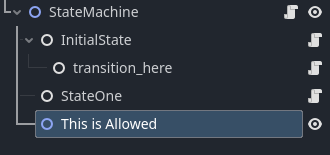

# Node-Based Finite State Machine

A node-oriented Finite State Machine for Godot (4.2+)

## Setup

1. Copy all files in `src` to your project.
2. Rename the classes as needed if there are conflicts with the global namespace.
3. Use it normally.

## Usage

### State Machine

This node is the root for all your states. You may have non-state nodes inside the state machine because the system would recursively detect root nodes. _IMPORTANT NOTE:_ the first state node will be the initial state by default.



To transition between states, you may use `transition` to send the event to the newly created finite state machine

```gdscript
extends Node2D

@onready var machine = $StateMachine

func _ready():
   machine.transition('transition_here')
```

### State Node

_IMPORTANT:_ The name of the node **IS** the name of the state. Normally, you should extend the state class for each state to provide for functionality.

```gdscript
extends State

func on_entry():
   print("Do something when the state is entered")

func on_process():
   print("Process here")

func on_exit():
   print("Cleanup")
```

_NOTE:_ Same as the `StateMachine` node, you may group nodes other than `Transition` in your state. It will detect the transitions automatically.

### Transition Node

Transition node _SHOULD_ be parented under state. Same as before, **the name of the node is the name of the event/signal/transition**. You should extend the transition node to access the lifecycle

```gdscript
extends Transition

func should_transition():
   # Check whether a transition should happen or not, this is the guard
   return true

func on_transition():
   print("Do something when transitioning to new state")
```

## Limitations and Maybe Improvement

-  States/transitions extension means there would be a lot of files just extending them, which could be VERY VERY annoying.
-  Does not support async/await
